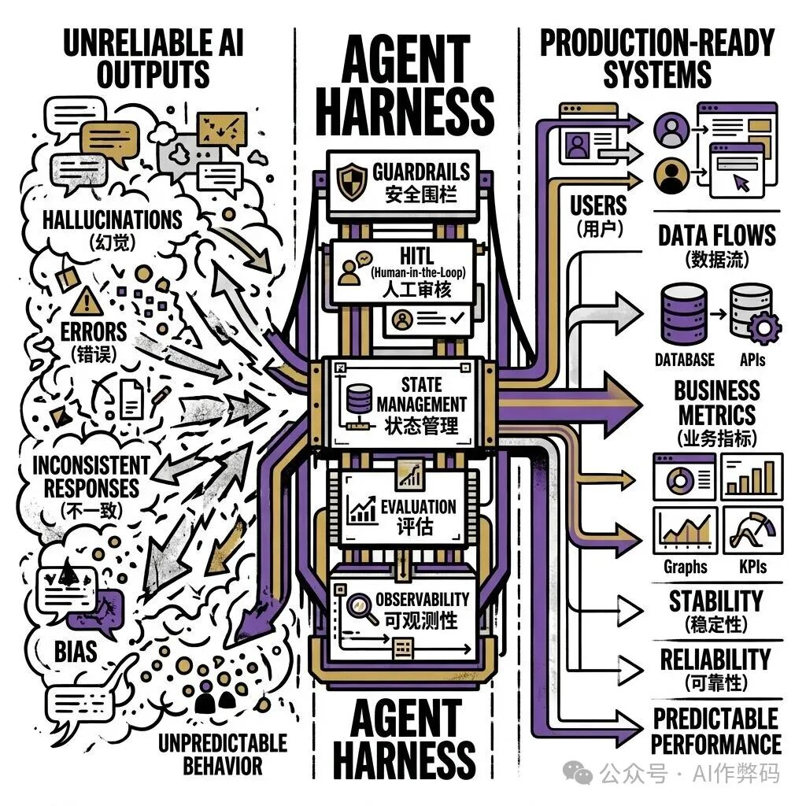
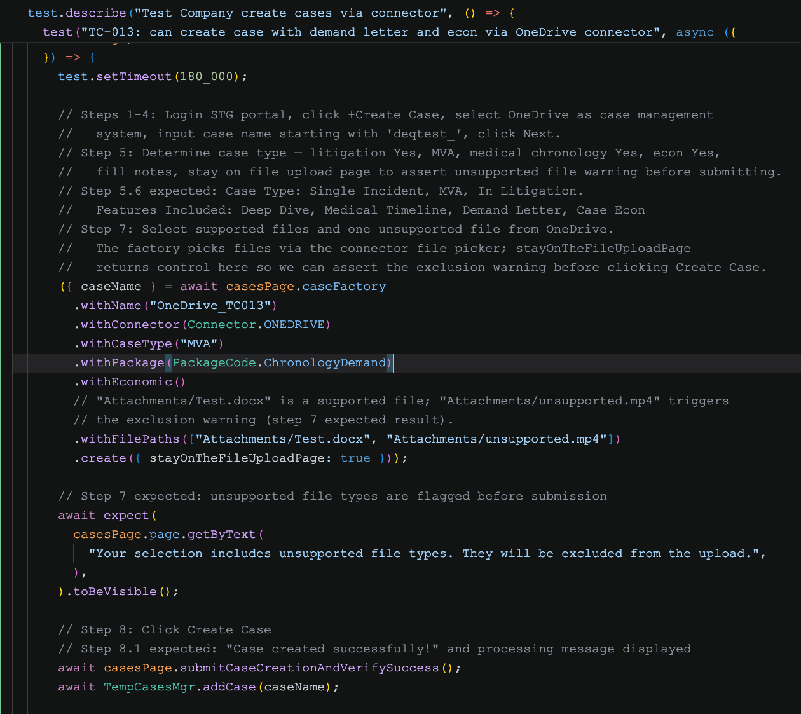

# Playwright Test Harness

一张截图 + 一句话，自动生成可运行的 Playwright 测试

<div class="pt-6 text-sm opacity-60">
generate-case-agent · 分享会 · ~30 min
</div>

<div class="abs-br m-6 text-xs opacity-40">
57blocks
</div>

---
layout: section
---

# 什么是 Harness？

---

## Harness 这个词从哪来

<div class="grid grid-cols-2 gap-8 items-center">
<div>

原意是马具——把一匹马的力量约束、引导到正确方向。

在软件工程里，**test harness** 通常指：

> 一套把测试工具"套"在一起的脚手架，让它们按规定的顺序、规定的接口协作。

这里的 **Playwright Test Harness** 做的是：

> 把 Claude Code 的多个专职 agent "套"在一起，形成一条从截图到通过测试的流水线。

你不需要知道每个 agent 内部在做什么，只需要喂入一张截图 + 一句触发短语。

</div>
<div>



</div>
</div>

---

## 为什么是 Harness 而不是一个大 Prompt？

<div class="text-sm opacity-70 mb-4">单个 LLM prompt 做全套：需求理解 → 设计 → 写代码 → 调试 → 总结</div>

<div class="grid grid-cols-2 gap-4 mb-6">
<div class="border border-red-200 rounded-lg p-4 bg-red-50">
  <div class="font-bold text-red-600 mb-1">💥 上下文爆炸</div>
  <div class="text-sm">调试输出全堆在一个 context 里，越到后期质量越差</div>
</div>
<div class="border border-orange-200 rounded-lg p-4 bg-orange-50">
  <div class="font-bold text-orange-600 mb-1">🔍 错误难归因</div>
  <div class="text-sm">selector 写错了？还是需求理解错了？prompt 里分不清</div>
</div>
<div class="border border-yellow-200 rounded-lg p-4 bg-yellow-50">
  <div class="font-bold text-yellow-600 mb-1">🔄 没有迭代回路</div>
  <div class="text-sm">测试跑挂了，单 prompt 不知道该怎么"自己修"</div>
</div>
<div class="border border-gray-200 rounded-lg p-4 bg-gray-50">
  <div class="font-bold text-gray-600 mb-1">📭 知识不沉淀</div>
  <div class="text-sm">这次踩的坑，下次重新踩</div>
</div>
</div>

<div class="border border-green-300 rounded-lg p-4 bg-green-50">
  <span class="font-bold text-green-700">Harness 的做法：</span>
  <span class="text-sm">每个专职 agent 只做一件事，通过 artifact 文件交接，失败时按类型回流到对应阶段修复。</span>
</div>

---
layout: section
---

# 为什么要做这个？

---

## 手写测试的重复劳动

每次写一条 Playwright 测试，你都在做一模一样的几件事：

<div class="flex items-center gap-1 my-8">
<div class="border border-gray-200 rounded-lg p-3 text-center flex-1">
  <div class="text-2xl mb-2">📄</div>
  <div class="text-xs font-bold mb-1">读用例</div>
  <div class="text-xs opacity-70">把 CSV 步骤翻译成代码逻辑</div>
</div>
<div class="text-gray-300 text-xl">→</div>
<div class="border border-gray-200 rounded-lg p-3 text-center flex-1">
  <div class="text-2xl mb-2">🔍</div>
  <div class="text-xs font-bold mb-1">找 Page Object</div>
  <div class="text-xs opacity-70">确认 selector 对不对</div>
</div>
<div class="text-gray-300 text-xl">→</div>
<div class="border border-gray-200 rounded-lg p-3 text-center flex-1">
  <div class="text-2xl mb-2">🖱️</div>
  <div class="text-xs font-bold mb-1">试 selector</div>
  <div class="text-xs opacity-70">在真实 UI 上反复试错</div>
</div>
<div class="text-gray-300 text-xl">→</div>
<div class="border border-gray-200 rounded-lg p-3 text-center flex-1">
  <div class="text-2xl mb-2">✍️</div>
  <div class="text-xs font-bold mb-1">写 spec</div>
  <div class="text-xs opacity-70">fixture 注入、断言格式</div>
</div>
<div class="text-gray-300 text-xl">→</div>
<div class="border border-gray-200 rounded-lg p-3 text-center flex-1">
  <div class="text-2xl mb-2">🐛</div>
  <div class="text-xs font-bold mb-1">调试</div>
  <div class="text-xs opacity-70">timing、spinner、虚拟滚动……</div>
</div>
</div>

<div class="border border-green-300 rounded-lg p-4 bg-green-50 text-center">
  <span class="font-bold text-green-700">这些步骤是有规律的——有规律的事情可以让 agent 来做。</span>
</div>

---

## 这套 harness 做了什么

<div class="grid grid-cols-2 gap-8 items-center">
<div class="text-sm">

**你之前的工作流：**

<div class="flex items-center gap-2 flex-wrap mt-3 opacity-60">
  <span class="border border-gray-300 rounded px-2 py-1">截图</span> →
  <span class="border border-gray-300 rounded px-2 py-1">你来读</span> →
  <span class="border border-gray-300 rounded px-2 py-1">你来设计</span> →
  <span class="border border-gray-300 rounded px-2 py-1">你来写代码</span> →
  <span class="border border-gray-300 rounded px-2 py-1">你来调试</span>
</div>

</div>
<div class="text-sm">

**用了 harness 之后：**

<div class="mt-3 space-y-1">
  <div class="bg-blue-50 border border-blue-200 rounded px-3 py-1.5">🖼️ 截图 + "增加 TC-050 用例"</div>
  <div class="text-center text-gray-300">↓</div>
  <div class="bg-gray-50 border border-gray-200 rounded px-3 py-1.5"><span class="font-mono text-xs font-bold">analyst</span> &nbsp; 读截图，拆成原子步骤</div>
  <div class="text-center text-gray-300">↓</div>
  <div class="bg-gray-50 border border-gray-200 rounded px-3 py-1.5"><span class="font-mono text-xs font-bold">architect</span> &nbsp; 选 Page Object，用 MCP 验 selector</div>
  <div class="text-center text-gray-300">↓</div>
  <div class="bg-gray-50 border border-gray-200 rounded px-3 py-1.5"><span class="font-mono text-xs font-bold">coder</span> &nbsp; 照着设计写代码，不猜 selector</div>
  <div class="text-center text-gray-300">↓</div>
  <div class="bg-gray-50 border border-gray-200 rounded px-3 py-1.5"><span class="font-mono text-xs font-bold">runner</span> &nbsp; 跑测试，按 stack trace 分类失败，自动修</div>
  <div class="text-center text-gray-300">↓</div>
  <div class="bg-gray-50 border border-gray-200 rounded px-3 py-1.5"><span class="font-mono text-xs font-bold">summarizer</span> &nbsp; 把这次踩的坑按类型写回项目知识库</div>
</div>

</div>
</div>

---
layout: section
---

# 架构：6 个专职 Agent

---

## 流水线总览


<div class="grid grid-cols-6 gap-2 mt-4 text-xs">
  <div class="border border-purple-200 bg-purple-50 rounded p-3 text-center flex flex-col gap-1">
    <div class="font-mono font-bold">add-test</div>
    <div class="opacity-60 leading-tight">编排者，路由各阶段 + 守护 artifacts</div>
    <div class="text-purple-400 mt-auto pt-2">sonnet</div>
  </div>
  <div class="border border-gray-200 bg-gray-50 rounded p-3 text-center flex flex-col gap-1">
    <div class="font-mono font-bold">analyst</div>
    <div class="opacity-60 leading-tight">读截图，拆原子步骤，必要时问你</div>
    <div class="text-gray-400 mt-auto pt-2">sonnet</div>
  </div>
  <div class="border border-blue-200 bg-blue-50 rounded p-3 text-center flex flex-col gap-1">
    <div class="font-mono font-bold">architect</div>
    <div class="opacity-60 leading-tight">选 Page Object，用 MCP 验 selector</div>
    <div class="text-blue-400 mt-auto pt-2">sonnet</div>
  </div>
  <div class="border border-gray-200 bg-gray-50 rounded p-3 text-center flex flex-col gap-1">
    <div class="font-mono font-bold">coder</div>
    <div class="opacity-60 leading-tight">照设计写代码，不开浏览器不猜 selector</div>
    <div class="text-gray-400 mt-auto pt-2">haiku</div>
  </div>
  <div class="border border-yellow-200 bg-yellow-50 rounded p-3 text-center flex flex-col gap-1">
    <div class="font-mono font-bold">runner</div>
    <div class="opacity-60 leading-tight">跑测试，读 stack trace，自己修或上抛</div>
    <div class="text-yellow-600 mt-auto pt-2">haiku</div>
  </div>
  <div class="border border-green-200 bg-green-50 rounded p-3 text-center flex flex-col gap-1">
    <div class="font-mono font-bold">summarizer</div>
    <div class="opacity-60 leading-tight">跑通后把经验写回知识库</div>
    <div class="text-green-600 mt-auto pt-2">sonnet</div>
  </div>
</div>

<div class="mt-3 text-xs text-gray-500 border border-gray-200 rounded p-2 bg-gray-50">
  🔒 <strong>工具权限最小化</strong>：analyst 没有 Bash，coder 没有 MCP，物理隔离防越权
</div>

---

## Artifact 文件协议

<div class="grid grid-cols-2 gap-8 items-center h-4/5">
<div class="flex flex-col gap-3">
  <div class="border border-gray-200 rounded-lg p-3 bg-gray-50 text-xs font-mono">
    <div class="text-gray-400 mb-1">analyst 写</div>
    <div class="font-bold">/tmp/tc_{case_id}_requirement.md</div>
    <div class="text-gray-500 mt-1">原子步骤 + 测试数据</div>
  </div>
  <div class="text-center text-gray-300">↓</div>
  <div class="border border-blue-200 rounded-lg p-3 bg-blue-50 text-xs font-mono">
    <div class="text-blue-400 mb-1">architect 写</div>
    <div class="font-bold">/tmp/tc_{case_id}_design.md</div>
    <div class="text-gray-500 mt-1">已验证的 selector 表 + page object 决策</div>
  </div>
  <div class="text-center text-gray-300">↓</div>
  <div class="border border-yellow-200 rounded-lg p-3 bg-yellow-50 text-xs font-mono">
    <div class="text-yellow-600 mb-1">runner 写</div>
    <div class="font-bold">/tmp/tc_{case_id}_run_report.md</div>
    <div class="text-gray-500 mt-1">每次迭代追加错误 + 修复记录</div>
  </div>
</div>
<div class="flex flex-col gap-4 text-sm">
  <div class="font-bold text-base">为什么用文件而不是直接传对话？</div>
  <div class="flex gap-3 items-start">
    <span class="text-red-400 text-lg">💥</span>
    <span>对话会把所有上下文堆到编排者里 → 几条用例就 context 爆炸</span>
  </div>
  <div class="flex gap-3 items-start">
    <span class="text-blue-400 text-lg">📄</span>
    <span>文件是"合同"：每个 agent 只读自己需要的那份，职责清晰</span>
  </div>
  <div class="flex gap-3 items-start">
    <span class="text-green-400 text-lg">✅</span>
    <span>天然检查点：中途失败可以从任意阶段重跑，不用从头来</span>
  </div>
</div>
</div>

---
layout: section
---

# 几个设计决策

---

## 两个关键设计决策

<div class="grid grid-cols-2 gap-8 h-4/5 items-center">
<div class="flex flex-col gap-3 text-sm">
  <div class="font-bold text-base">为什么用文件而不是函数调用？</div>
  <div class="text-xs text-gray-500">直接让 orchestrator 调用每个 agent 函数、传返回值不行吗？</div>
  <div class="flex flex-col gap-2 mt-1">
    <div class="flex gap-2 items-start border border-red-200 bg-red-50 rounded p-2">
      <span>💥</span>
      <span>每个阶段的输出都进 orchestrator 的上下文，5 个阶段 × N 条用例 = context 爆炸</span>
    </div>
    <div class="flex gap-2 items-start border border-blue-200 bg-blue-50 rounded p-2">
      <span>📄</span>
      <span>文件是天然的"检查点"，中途失败可以从任意阶段重跑，不用从头来</span>
    </div>
  </div>
</div>

<div class="flex flex-col gap-3 text-sm border-l border-gray-200 pl-8">
  <div class="font-bold text-base">为什么 MCP 验证放在 architect 而不是 coder？</div>
  <div class="flex flex-col gap-2 mt-1">
    <div class="flex gap-2 items-start border border-gray-200 bg-gray-50 rounded p-2">
      <span>🔒</span>
      <span>coder 只有 Read/Write/Edit/Bash，<strong>物理上没有 MCP 工具</strong></span>
    </div>
    <div class="flex gap-2 items-start border border-gray-200 bg-gray-50 rounded p-2">
      <span>✅</span>
      <span>强制 selector 验证发生在设计阶段，coder 照单全收，不猜</span>
    </div>
    <div class="flex gap-2 items-start border border-gray-200 bg-gray-50 rounded p-2">
      <span>🔄</span>
      <span>selector 也错了？escalate 回 architect 重验，不是让 coder 猜</span>
    </div>
  </div>
  <div class="border border-green-200 bg-green-50 rounded p-2 text-xs mt-1">
    coder 成为纯粹的<strong>"翻译器"</strong>，可以用更加便宜的模型
  </div>
</div>
</div>

---

## knowledge 沉淀是怎么工作的

<div class="grid grid-cols-2 gap-8 items-center h-4/5">
<div class="flex flex-col gap-3 text-sm">
  <div class="font-bold text-base mb-1">summarizer 只在满足以下条件时写新知识：</div>
  <div class="flex gap-2 items-center border border-gray-200 bg-gray-50 rounded p-2">
    <span class="text-lg">1️⃣</span>
    <span>它<strong>造成了可明显的问题</strong>（迭代 loop 或错误结果）</span>
  </div>
  <div class="flex gap-2 items-center border border-gray-200 bg-gray-50 rounded p-2">
    <span class="text-lg">2️⃣</span>
    <span>它是<strong>抽象可复用的</strong>（靠 LLM 自己身做一个泛化推理）</span>
  </div>
  <div class="flex gap-2 items-center border border-gray-200 bg-gray-50 rounded p-2">
    <span class="text-lg">3️⃣</span>
    <span>它<strong>不是常识</strong>（不是playwright常见的实践等）</span>
  </div>
  <div class="border border-orange-200 bg-orange-50 rounded p-2 text-xs mt-1">
    不满足就跳过——<strong>宁可少写，不要噪音。</strong>
  </div>
</div>
<div class="flex flex-col gap-2 text-sm border-l border-gray-200 pl-8">
  <div class="font-bold text-base mb-1">写到哪里：</div>
  <div class="flex gap-3 items-center border border-gray-200 bg-gray-50 rounded p-2">
    <span>📋</span>
    <div><div class="font-bold text-xs">通用 UI 自动化规则</div><div class="text-xs text-gray-500">项目 CLAUDE.md</div></div>
  </div>
  <div class="flex gap-3 items-center border border-blue-200 bg-blue-50 rounded p-2">
    <span>🤖</span>
    <div><div class="font-bold text-xs">某个 agent 的系统性错误</div><div class="text-xs text-gray-500">对应 agent .md 文件</div></div>
  </div>
  <div class="flex gap-3 items-center border border-purple-200 bg-purple-50 rounded p-2">
    <span>🏷️</span>
    <div><div class="font-bold text-xs">项目级事实（feature flag 等）</div><div class="text-xs text-gray-500 font-mono">.claude/context/project-facts.md</div></div>
  </div>
  <div class="flex gap-3 items-center border border-gray-200 bg-gray-50 rounded p-2 opacity-60">
    <span>👤</span>
    <div><div class="font-bold text-xs">个人协作偏好</div><div class="text-xs text-gray-500">本地 memory（不进 git）</div></div>
  </div>
</div>
</div>

---
layout: section
---

# 怎么用

---

## 假设你用例长这样


---

## 触发方式

<div class="grid grid-cols-[3fr_7fr] gap-6 items-center" style="height: 65%">
<div>

把用例截图拖进 Claude Code 对话，加一句话：

```
增加 SA-001 用例
add test for TC-050
更新 TC-050 用例
在 supioadmin 文件夹下增加用例
```

</div>
<div>


</div>
</div>

<div class="border-t border-gray-200 pt-3 mt-2 text-sm grid grid-cols-3 gap-4">
<div>① role 没写清楚 → analyst 问你</div>
<div>② 测试数据缺失 → analyst 问你</div>
<div>③ 共用方法有变动 → architect 给你 <code>⚠️ BREAKING RISK</code> 提示</div>
</div>

---

## 产出结果

<div class="grid grid-cols-[5fr_5fr] gap-6 items-center">
<div class="text-sm">

architect 读取 `.claude/skills/` 里的可复用操作模板，照单生成，不猜不发明。

```typescript
test("create a case", async ({ casesPage }) => {
  const { caseName } = await casesPage.caseFactory
    .withInternalIdentity()
    .withName("placeholder")
    .withConnector(Connector.DEFAULT)
    .withCaseType("MVA")
    .withPackage(PackageCode.Chronology)
    .withCompany("QA Test CA Company")
    .create();

  expect(caseName).toBeTruthy();
});
```

基于 `.claude/skills/create-case.md` 模板生成

</div>
<div>



</div>
</div>

---

## 运行过程中你会看到什么

```text
📋 Iteration 1: running test...
  ✗ Failed: locator.click: element not found
  → Classifying: selector error
  → Fixing: button[data-icon="edit"] → button:has([data-icon="edit"])

📋 Iteration 2: running test...
  ✓ Passed

📝 Session Summary
  - Implemented: TC-050 verify flowsheet event time display
  - Reused: FlowsheetsPage.openEvent()
  - Added to CLAUDE.md: Ant Design icon selector pattern
```

<br>

失败自己修，最多 5 次；超过就停下来告诉你下一步怎么排查。


---
layout: section
---

# 接入到你自己的项目

---

## 项目需要准备什么（知识层面）

harness 把知识分 5 类：

<div class="grid grid-cols-2 gap-3 mt-4 text-xs">
  <div class="border border-gray-200 rounded-lg p-3 bg-gray-50">
    <div class="font-bold mb-1">🅐 通用 Playwright 规则</div>
    <div class="opacity-60 mb-2">不要用 isVisible() 门控点击…</div>
    <div class="font-mono text-gray-500">.claude/context/coding-rules.md</div>
    <div class="text-orange-500 text-xs mt-1">← harness 提供模板</div>
  </div>
  <div class="border border-blue-200 rounded-lg p-3 bg-blue-50">
    <div class="font-bold mb-1">🅑 项目编码风格</div>
    <div class="opacity-60 mb-2">点击前先等 .ant-spin-spinning 消失；toast 断言用 page.locator 不用 expect(page)…</div>
    <div class="font-mono text-gray-500">CLAUDE.md / .claude/context/coding-rules.md</div>
    <div class="text-blue-500 text-xs mt-1">← 你的项目维护</div>
  </div>
  <div class="border border-purple-200 rounded-lg p-3 bg-purple-50">
    <div class="font-bold mb-1">🅒 可复用操作 Skill</div>
    <div class="opacity-60 mb-2">业务流程或技术模式，被多条测试调用</div>
    <div class="font-mono text-gray-500">.claude/skills/*.md</div>
    <div class="text-purple-500 text-xs mt-1">← 你的项目维护</div>
  </div>
  <div class="border border-green-200 rounded-lg p-3 bg-green-50">
    <div class="font-bold mb-1">🅓 项目级事实</div>
    <div class="opacity-60 mb-2">feature flag、测试数据 ID、环境约束</div>
    <div class="font-mono text-gray-500">.claude/context/project-facts.md</div>
    <div class="text-green-600 text-xs mt-1">← summarizer 自动写入，git 共享</div>
  </div>
  <div class="border border-gray-200 rounded-lg p-3 bg-gray-50 col-span-2">
    <div class="font-bold mb-1">🅔 真实可跑的代码示例</div>
    <div class="opacity-60 mb-1">architect 自动 glob 读取，无需额外维护</div>
    <div class="font-mono text-gray-500">tests/ 和 pages/</div>
  </div>
</div>

---

## 用其他 IDE？

<div class="grid grid-cols-3 gap-4 mt-2 mb-3">
  <div class="border-2 border-green-300 bg-green-50 rounded-xl p-4">
    <div class="flex items-center gap-2 mb-2"><span class="text-lg">✅</span><span class="font-bold text-green-700 text-sm">Claude Code</span></div>
    <div class="text-xs text-gray-600">完整流水线、自动回流、MCP selector 验证，原生支持</div>
  </div>
  <div class="border-2 border-yellow-300 bg-yellow-50 rounded-xl p-4">
    <div class="flex items-center gap-2 mb-2"><span class="text-lg">⚠️</span><span class="font-bold text-yellow-700 text-sm">Cursor 2.4+</span></div>
    <div class="text-xs text-gray-600">有真正的 sub-agent 隔离（<code>.cursor/agents/*.md</code>），但自动失败回流无原生支持</div>
  </div>
  <div class="border-2 border-orange-200 bg-orange-50 rounded-xl p-4">
    <div class="flex items-center gap-2 mb-2"><span class="text-lg">⚠️</span><span class="font-bold text-orange-600 text-sm">GitHub Copilot</span></div>
    <div class="text-xs text-gray-600">已支持 MCP 和 agent mode，但 harness 的 artifact 流水线架构需重新适配</div>
  </div>
</div>

<div class="border-t border-gray-200 pt-3 mb-3">
  <span class="text-xs text-gray-400">如果一定要迁移</span>
</div>

<div class="grid grid-cols-2 gap-4">
  <div class="border border-yellow-200 rounded-xl p-4 bg-yellow-50 text-xs">
    <div class="font-bold text-yellow-700 text-sm mb-3">Cursor 迁移步骤</div>
    <div class="flex flex-col gap-2 text-gray-700">
      <div class="flex gap-2"><span class="shrink-0 text-yellow-500 font-bold">1.</span><span>把各阶段定义为 <code>.cursor/agents/*.md</code>，每个有独立 context window</span></div>
      <div class="flex gap-2"><span class="shrink-0 text-yellow-500 font-bold">2.</span><span>MCP 配置放项目级 <code>.cursor/mcp.json</code>（全局配置有可靠性问题）</span></div>
      <div class="flex gap-2"><span class="shrink-0 text-yellow-500 font-bold">3.</span><span>orchestrator 可 LLM 自动委派；<code>/tmp/tc_*.md</code> 协议可行但需写进 prompt</span></div>
      <div class="flex gap-2 mt-1 text-red-600 font-medium"><span class="shrink-0">✗</span><span>自动失败回流无原生支持，失败后需人工介入</span></div>
    </div>
  </div>
  <div class="border border-orange-200 rounded-xl p-4 bg-orange-50 text-xs">
    <div class="font-bold text-orange-600 text-sm mb-3">Copilot 迁移步骤</div>
    <div class="flex flex-col gap-2 text-gray-700">
      <div class="flex gap-2"><span class="shrink-0 text-orange-400 font-bold">1.</span><span>用 <code>.github/agents/*.agent.md</code> 定义各阶段（VS Code / Visual Studio 2026）</span></div>
      <div class="flex gap-2"><span class="shrink-0 text-orange-400 font-bold">2.</span><span>配置 MCP Playwright；<code>/tmp/tc_*.md</code> 协议物理可行但需写进 prompt</span></div>
      <div class="flex gap-2"><span class="shrink-0 text-orange-400 font-bold">3.</span><span>用 <code>handoffs</code> 实现阶段跳转，但需人工点击触发</span></div>
      <div class="flex gap-2 mt-1 text-red-600 font-medium"><span class="shrink-0">✗</span><span>自动编排和自动回流均不支持</span></div>
    </div>
  </div>
</div>

---
layout: end
---

# 试试看

```bash
git clone https://github.com/57blocks/generate-case-agent
```

有问题随时找我 🙌
